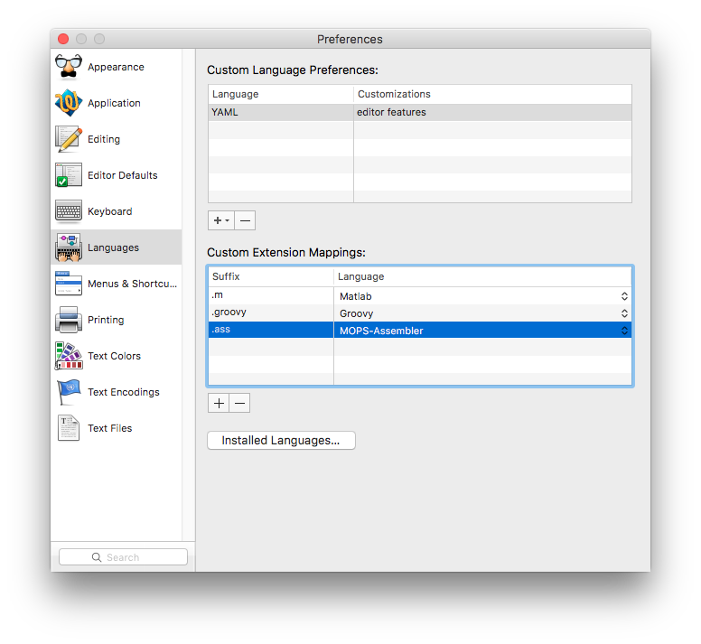
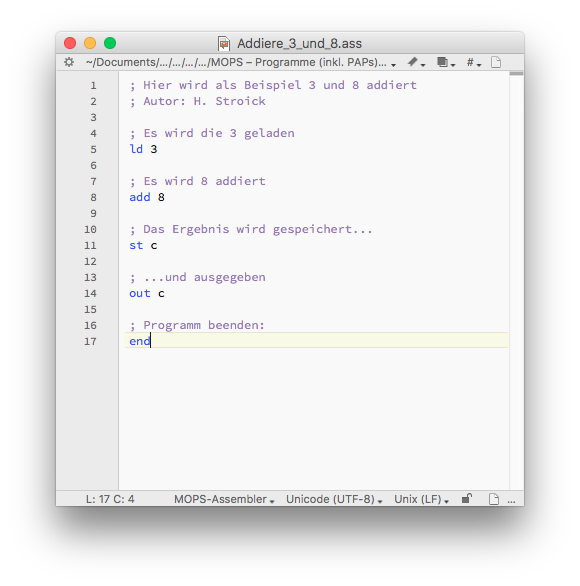

# Syntax-Highlighting für MOPS (MOdellrechner mit PSeudo-Assembler)

Dies ist eine Erweiterung für [Textwrangler](http://www.barebones.com/products/textwrangler/) für den Mac, um die vom [MOPS](www.viktorianer.de/info/mops.html) erstellten Dateien korrekt darzustellen.

MOPS speichert Dateien mit der Endung `.ass`. Nach der Installation wird die Syntax korrekt hervorgehoben.

## Installation

Die Datei `MOPS.plist` muss in das Verzeichnis `~/Library/Application Support/TextWrangler/Language Modules` kopiert werden.

In den Einstellungen muss die Dateiendung `.ass` mit der Sprache verknüpft werden (letzte Zeile in der unteren Tabelle im Bild, blau hervorgehoben):

Nach einem Neustart von TextWrangler funktioniert das Syntax-Highlighting.

## Beispiel
Tipp: Eventuell muss unten links MOPS-Assembler ausgewählt werden.

## Tipp
Man kann in den Informationen einer `.ass`-Datei festlegen, dass Dateien dieses Typs immer mit TextWrangler geöffnet werden.

## Lizenz
Die Dateien dieses Repositorys steht unter einer [WTFPL – Do What the Fuck You Want to Public License](http://www.wtfpl.net/).